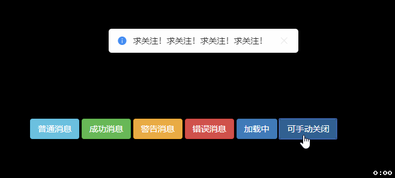
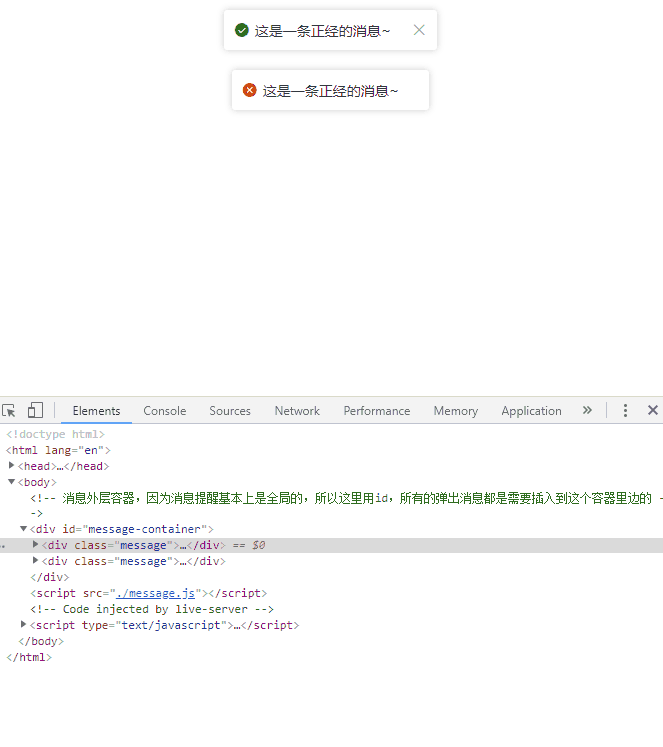
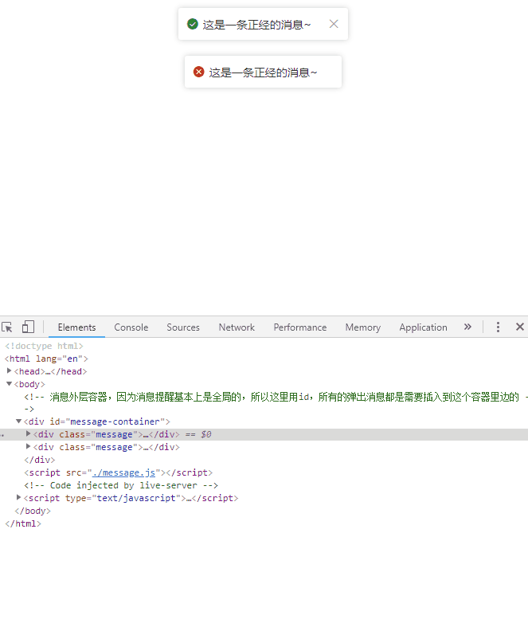
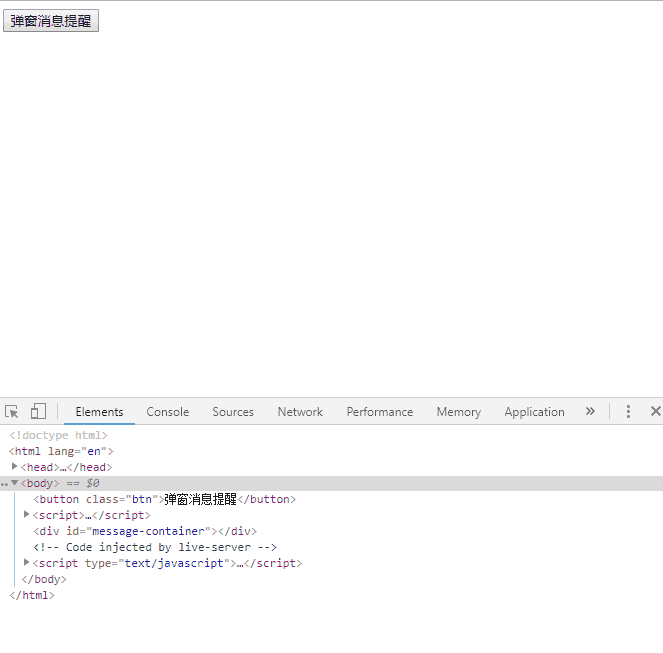
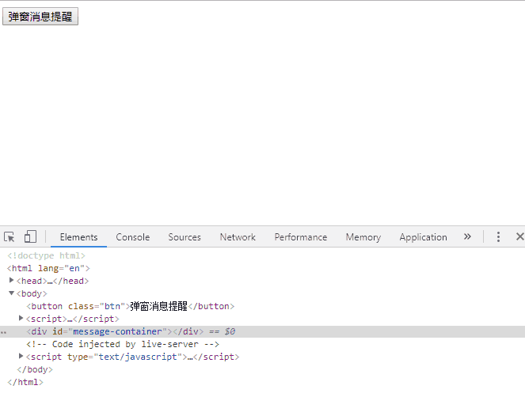
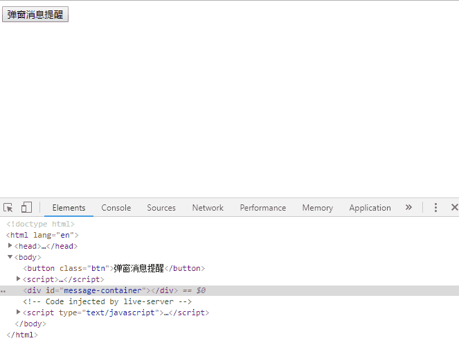
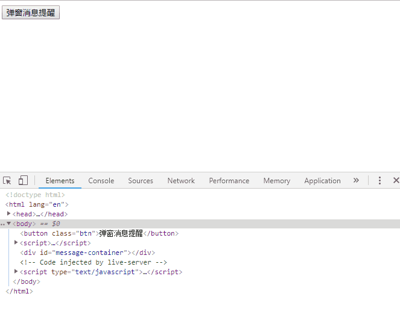

# message_js
如何用原生js写一个弹窗消息提醒插件

如何用原生js写一个弹窗消息提醒插件
嗨，这里是芝麻，今天我们一块来做一个“弹窗消息提醒”插件。

喏，就是这么一个效果。

1. 分析
当消息被触发的时候，会有一个自上而下的淡入过程。
在持续了一段时间后会自动的消失，或者是需要用户来手动的点击关闭按钮。
在消息消失的时候，会有一个自下而上的淡出过程。
消息是可以叠加弹出的，最新的消息会排在消息列表的最后面。
当前面的消息消失后，后面的消息会有一个向上滑动效果。
然后消息本身是有三部分组成

消息图标，用来区分不同类型的消息。
消息文本。
关闭按钮，并不是所有消息都需要关闭按钮。
2. 实现样式
那么，不管我们是用原生js还是vue，首先呢，我们都需要把这个消息的基本样式给写出来，然后再通过js来控制消息的弹出和关闭。
所以，我们先来写html和css。

<!-- message.html -->

<!-- 这个css是我引用阿里的一些字体图标，请戳： https://www.iconfont.cn/ -->
<link rel="stylesheet" href="http://at.alicdn.com/t/font_1117508_wxidm5ry7od.css">
<link rel="stylesheet" href="./message.css">

<!-- 消息外层容器，因为消息提醒基本上是全局的，所以这里用id，所有的弹出消息都是需要插入到这个容器里边的 -->

    

        <!-- 消息图标 icon icon-success对应我的阿里字体图标的font-class -->
        

        <!-- 消息文本 -->
        
这是一条正经的消息~

        <!-- 关闭按钮 -->
        

    

    

        

        
这是一条正经的消息~

    

<!-- /* message.css */ -->

#message-container {
    position: fixed;
    left: 0;
    top: 0;
    right: 0;

    /* 采用flex弹性布局，让容器内部的所有消息可以水平居中，还能任意的调整宽度 */
    display: flex;
    flex-direction: column;
    align-items: center;
}
#message-container .message {
    background: #fff;
    margin: 10px 0;
    padding: 0 10px;
    height: 40px;
    box-shadow: 0 0 10px 0 #eee;
    font-size: 14px;
    border-radius: 3px;

    /* 让消息内部的三个元素（图标、文本、关闭按钮）可以垂直水平居中 */
    display: flex;
    align-items: center;
}
#message-container .message .text {
    color: #333;
    padding: 0 20px 0 5px;
}
#message-container .message .close {
    cursor: pointer;
    color: #999;
}

/* 给每个图标都加上不同的颜色，用来区分不同类型的消息 */
#message-container .message .icon-info {
    color: #0482f8;
}
#message-container .message .icon-error {
    color: #f83504;
}
#message-container .message .icon-success {
    color: #06a35a;
}
#message-container .message .icon-warning {
    color: #ceca07;
}
#message-container .message .icon-loading {
    color: #0482f8;
}

大概是这么一个效果：

3. 实现动画
接下来要做的就是这个消息的弹出和消失动画，我们还是用css来实现。

想要在css里边实现自定义的动画，首先需要用@keyframes来定义一个动画规则，然后再通过animation属性把动画应用到某个元素上就可以了。
所谓的动画规则其实就是一个动画序列，或者可以理解为一个个的关键帧，而关键帧的内部就是你想改变的css属性，你可以在关键帧里边写上几乎任何的css属性，当动画被应用的时候，这些css属性就会根据各个关键帧做出相应的变换。

那我们先用@keyframes来写一个动画规则吧

/* message.css */

/* 这个动画规则我们就叫做message-move-in吧，随后我们会用animation属性在某个元素上应用这个动画规则。 */
@keyframes message-move-in {
    0% {
        /* 前边分析过了，弹出动画是一个自上而下的淡入过程 */
        /* 所以在动画初始状态要把元素的不透明度设置为0，在动画结束的时候再把不透明度设置1，这样就会实现一个淡入动画 */
        opacity: 0;
        /* 那么“自上而下”这个动画可以用“transform”变换属性结合他的“translateY”上下平移函数来完成 */
        /* translateY(-100%)表示动画初始状态，元素在实际位置上面“自身一个高度”的位置。 */
        transform: translateY(-100%);
    }
    100% {
        opacity: 1;
        /* 平移到自身位置 */
        transform: translateY(0);
    }
}

然后我们再定义一个和message元素同级的类move-in，把message-move-in这个动画规则给应用到move-in类上，这样我们需要让哪个消息弹出，就只需要在消息的类上加一个move-in就行。

/* message.css */

#message-container .message.move-in {
    /* animation属性是用来加载某个动画规则 请参考 https://developer.mozilla.org/zh-CN/docs/Web/CSS/animation */
    animation: message-move-in 0.3s ease-in-out;
}

我们来看下怎么用这个move-in：

可以看到，只需要在某个message上追加一个move-in就能实现弹出动画。
那么，消失动画也是一个套路，只不过跟弹出动画反过来而已。
/* message.css */

@keyframes message-move-out {
    0% {
        opacity: 1;
        transform: translateY(0);
    }
    100% {
        opacity: 0;
        transform: translateY(-100%);
    }
}

#message-container .message.move-out {
    animation: message-move-out 0.3s ease-in-out;
    /* 让动画结束后保持结束状态 */
    animation-fill-mode: forwards;
}

animation-fill-mode: forwards;这个是干嘛的呢？因为动画结束后默认会回到元素的最初状态，在这里表现的是消失后又出现了，
如图：

所以animation-fill-mode: forwards;是为了让动画结束后保持这个结束状态，也就是不在显示了。

4. 编写js插件
那么，在写js之前呢，我们先来思考一下，如果你是插件的使用者，你想怎么来调用这个插件？
我们的插件很简单，就是在需要的时候弹出一个消息，假设插件他提供给我们的是一个类，就叫做Message吧，并且他内部有一个show方法，那么只要使用者实例化这个类后，调用他的show方法，然后传入不同的参数就可以弹出一个消息了。而且我们所实例化的对象可以是全局唯一的。
<!-- message.html -->
<!-- 省略... -->

所以呢，我们要先写一个Message类，并且必须要实现一个show方法。
/* message.js */

class Message {
    constructor() {

    }

    show({ type = 'info', text = '' }) {

    }
}

这里我直接用了es6的class关键词，其实他的内部还是原型链的形式。用class呢，可以让我们更直观的了解这个类。

根据我们在第一部分的分析，所有的消息元素都是需要在js中创建的，所以我们不需要使用者来写任何html代码，那么我们只需要在对象被实例化new Message()的时候，就去创建消息容器message-container，后续在调用show方法时候，直接把消息插入到message-container内部即可。

/* message.js */

class Message {

    /**
     * 构造函数会在实例化的时候自动执行
     */
    constructor() {
        const containerId = 'message-container';
        // 检测下html中是否已经有这个message-container元素
        this.containerEl = document.getElementById(containerId);

        if (!this.containerEl) {
            // 创建一个Element对象，也就是创建一个id为message-container的dom节点
            this.containerEl = document.createElement('div');
            this.containerEl.id = containerId;
            // 把message-container元素放在html的body末尾
            document.body.appendChild(this.containerEl);
        }
    }

    show({ type = 'info', text = '' }) {

    }
}

这样，我们调用const message = new Message()的时候会在dom中自动的插入一个message-container节点。
那么，最重要的还是我们的show方法：

创建一个消息节点，并把它追加到message-container容器的末尾。
设定一个时间，在这个时间结束后自动的将消息移除。
监听“关闭按钮”的click事件，来让用户可以手动的移除消息。
我们一步一步来。

4.1 创建一个消息节点，并把它追加到message-container容器的末尾。
class Message {

    // 省略...

    show({ type = 'info', text = '' }) {
        // 创建一个Element对象
        let messageEl = document.createElement('div');
        // 设置消息class，这里加上move-in可以直接看到弹出效果
        messageEl.className = 'message move-in';
        // 消息内部html字符串
        messageEl.innerHTML = `
            
            
${text}

            

        `;
        // 追加到message-container末尾
        // this.containerEl属性是我们在构造函数中创建的message-container容器
        this.containerEl.appendChild(messageEl);
    }
}

我们来调用下试试~
<!-- message.html -->
<!-- 省略... -->

    <button class="btn">弹窗消息提醒</button>

    

4.2 设定一个时间，在这个时间结束后自动的将消息移除。

// message.js

class Message {

    // 省略...

    show({ type = 'info', text = '', duration = 2000 }) {
        // 省略...

        // 用setTimeout来做一个定时器
        setTimeout(() => {
            // Element对象内部有一个remove方法，调用之后可以将该元素从dom树种移除！
            messageEl.remove();
        }, duration);
    }
}

可以看到，消息在过了2秒后，自动的从dom树中移除了，不过呢并没有动画，还记得前边我们写了move-out类吗？这个类和message是同级的。现在我们只需要在定时结束后把这个类应用到message元素上就行。

// message.js

class Message {

    // 省略...

    show({ type = 'info', text = '', duration = 2000 }) {
        // 省略...

        // 用setTimeout来做一个定时器
        setTimeout(() => {
            // 首先把move-in这个弹出动画类给移除掉，要不然会有问题，可以自己测试下
            messageEl.className = messageEl.className.replace('move-in', '');
            // 增加一个move-out类
            messageEl.className += 'move-out';

            // 这个地方是监听动画结束事件，在动画结束后把消息从dom树中移除。
            // 如果你是在增加move-out后直接调用messageEl.remove，那么你不会看到任何动画效果
            messageEl.addEventListener('animationend', () => {
                // Element对象内部有一个remove方法，调用之后可以将该元素从dom树种移除！
                messageEl.remove();
            });
        }, duration);
    }
}

注意观察dom树的变化：

4.3 监听“关闭按钮”的click事件，来让用户可以手动的移除消息。
有时候呢，我们希望消息能够一直展示，直到用户来手动的关闭掉，那么首先我们要加一个参数，用来控制是否展示这个关闭按钮。
// message.js

class Message {

    // 省略...

    show({ type = 'info', text = '', duration = 2000, closeable = false }) {
        // 创建一个Element对象
        let messageEl = document.createElement('div');
        // 设置消息class，这里加上move-in可以直接看到弹出效果
        messageEl.className = 'message move-in';
        // 消息内部html字符串
        messageEl.innerHTML = `
            
            
${text}

        `;

        // 是否展示关闭按钮
        if (closeable) {
            // 创建一个关闭按钮
            let closeEl = document.createElement('div');
            closeEl.className = 'close icon icon-close';
            // 把关闭按钮追加到message元素末尾
            messageEl.appendChild(closeEl);

            // 监听关闭按钮的click事件，触发后将调用我们的close方法
            // 我们把刚才写的移除消息封装为一个close方法
            closeEl.addEventListener('click', () => {
                this.close(messageEl)
            });
        }

        // 追加到message-container末尾
        // this.containerEl属性是我们在构造函数中创建的message-container容器
        this.containerEl.appendChild(messageEl);

        // 只有当duration大于0的时候才设置定时器，这样我们的消息就会一直显示
        if (duration > 0) {
            // 用setTimeout来做一个定时器
            setTimeout(() => {
                this.close(messageEl);
            }, duration);
        }
    }

    /**
     * 关闭某个消息
     * 由于定时器里边要移除消息，然后用户手动关闭事件也要移除消息，所以我们直接把移除消息提取出来封装成一个方法
     * @param {Element} messageEl
     */
    close(messageEl) {
        // 首先把move-in这个弹出动画类给移除掉，要不然会有问题，可以自己测试下
        messageEl.className = messageEl.className.replace('move-in', '');
        // 增加一个move-out类
        messageEl.className += 'move-out';

        // 这个地方是监听动画结束事件，在动画结束后把消息从dom树中移除。
        // 如果你是在增加move-out后直接调用messageEl.remove，那么你不会看到任何动画效果
        messageEl.addEventListener('animationend', () => {
            // Element对象内部有一个remove方法，调用之后可以将该元素从dom树种移除！
            messageEl.remove();
        });
    }
}

我们来调用下试试~
<!-- message.html -->
<!-- 省略... -->

    <button class="btn">弹窗消息提醒</button>

    

其实已经写的差不多了，不过还是有一些小问题，比如当我们弹出两个甚至更多消息的时候，如果前边的消息消失后，下面的消息会直接跳到上面的位置，很僵硬，没有任何的滑动，如图：

很僵硬有木有
我们可以通过css的transition属性来让meesage的高度逐渐变小，这样下面的元素就会根据变化来逐渐上移。
/* message.css */
/* 省略... */

#message-container .message {
    background: #fff;
    margin: 10px 0;
    padding: 0 10px;
    height: 40px;
    box-shadow: 0 0 10px 0 #ccc;
    font-size: 14px;
    border-radius: 3px;

    /* 让消息内部的三个元素（图标、文本、关闭按钮）可以垂直水平居中 */
    display: flex;
    align-items: center;

    /* 增加一个过渡属性，当message元素的高度和margin变化时候将会有一个过渡动画 */
    transition: height 0.2s ease-in-out, margin 0.2s ease-in-out;
}

/* 省略... */

然后我们只需要在Message类的close方法中做一下改变：

close(messageEl) {
        // 首先把move-in这个弹出动画类给移除掉，要不然会有问题，可以自己测试下
        messageEl.className = messageEl.className.replace('move-in', '');
        // 增加一个move-out类
        messageEl.className += 'move-out';

        // move-out动画结束后把元素的高度和边距都设置为0
        // 由于我们在css中设置了transition属性，所以会有一个过渡动画
        messageEl.addEventListener('animationend', () => {
            messageEl.setAttribute('style', 'height: 0; margin: 0');
        });

        // 这个地方是监听transition的过渡动画结束事件，在动画结束后把消息从dom树中移除。
        messageEl.addEventListener('transitionend', () => {
            // Element对象内部有一个remove方法，调用之后可以将该元素从dom树种移除！
            messageEl.remove();
        });
    }

看效果：

很平滑有木有
结尾
好了，基本上已经写好了，不过为了各个浏览器的兼容性，建议大家用babel转码，如果想发布，可以用webpack把js和css一块打包。
不过我们还是少考虑了一个场景，现在的关闭消息都是对象内部调用close方法来实现，如果我们希望外部能够控制消息的关闭呢，比如我请求服务器时候弹出一个loading的消息，现在服务器返回数据后，我怎么来关闭这个消息呢。
很简单，各位自行实现吧！
https://www.cnblogs.com/mr-zhima/articles/js-message.html
